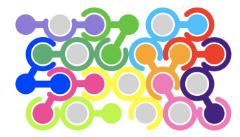
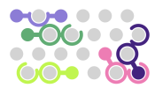
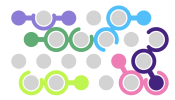
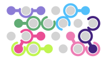
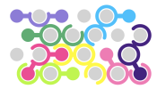
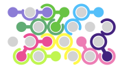
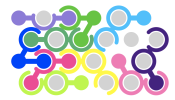
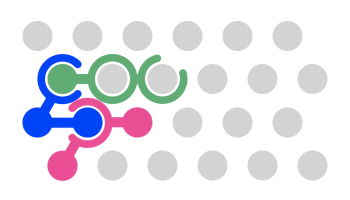
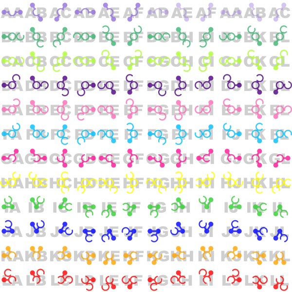

## Project Description

The project involves implementing in Java an board game called [IQ-link](http://www.smartgames.eu/en/smartgames/iq-link)
made by the Dutch games developer [SmartGames](http://www.smartgames.eu/en).

#### Objective 

The game is a puzzle; the objective is to place all twelve colored playing pieces
onto a board comprising 24 pegs which are arranged hexagonally.  The placement must
ensure that all of the pieces fit together correctly.

A completed game:

The following sequence shows the progression of a solution to the game above.

#### Pieces

The game comprises **12 playing pieces**, each of which consists of three **units**.
The center unit (index = 1) is defined to be the **origin** of the piece (the placement of
the piece is defined in terms of the placement of the center unit).  A unit may
either be a **ball**, or a **ring**.  Each ball has one or two 
**connections** extending from it.  Each ring has zero, one, or two **openings**.
A ball and a ring may be placed on the same peg so long as the ball's *connection*
fits exactly in one of the ring's *openings*.  The units that form a piece are
numbered 0, 1 and 2, with 1 being the origin (the center unit), 0 being the 
unit to its left in the default ('A') orientation, and 2 being the remaining 
unit.

For example, the illustration below shows three of the pieces from the completed
game above.  The ball at the left end of the green piece has a *connection* to
the right, and that connection fits exactly through the *opening* in the ring
at the top of the blue piece.  Likewise, the *opening* in the pink piece is in
exactly the right place to accommodate the *connection* from the blue piece.

Each piece can be **flipped** and **rotated** at 60 degree increments, allowing
for 12 different **orientations** (six rotations and a flip).  The following 
illustration shows all 144 possible combinations of the 12 pieces and 12 orientations.
Note that the first piece exhibits rotational symmetry, so 6 of its rotations
are isomorphic (shown as faint), yielding a total of **138 distinct piece 
orientations** (144 - 6 isomorphisms).

Notice that the center unit of piece A is an example a ring with two openings, 
and the center unit of piece I is an example of a ball with two connections.  The
center unit of piece B is an example of a ring with no openings.

#### Encoding Game State

Game states are encoded as strings.  Your game will need to be able to initialize
itself using these strings and some of your tasks relate directly to these strings.
For example, the game described above is characterized (when complete) by the 
string `BAAHBATCJRDKWEBEFDNGLPHEDIFMJJQKIKLJ`.

##### Placement Strings

A placement string consists of 
between one and twelve (inclusive) **piece placements**. The placement string
may not include any piece twice.

##### Piece Placement Strings

A piece placement string consists of three characters describing the location 
and orientation of a particular piece on the board:

* The first character identifies which peg the origin of the piece is to be placed on ('A' to 'X').
* The second character identifies which of the tweleve pieces is being placed ('A' to 'L').
* The third character identifies which orientation the piece is in ('A' to 'L', except for piece 'A', which has only 'A' to 'F').

The image above shows the second and third characters for each of the pieces in
each of their orientations.   For example, at top left, 'AA' desribes piece 'A'
at orientation 'A'.  Below it, 'BA' describes piece 'B' at orientation 'A'.  At
the bottom right 'LL' describes piece 'L' at orientation 'L'.  And so on.

The progression of twelve images above shows the progression of the game `BAAHBATCJRDKWEBEFDNGLPHEDIFMJJQKIKLJ`,
starting with `BAA`, then showing `BAAHBA`, etc.

##### Legal Piece Placements

Pieces must be placed so that they are strictly non-overlapping.   This means
that a ball can only go in a ring if a) there is not already a ball there, and
b) that there's an opening in the ring at exactly the right place.  A ball cannot
be placed on a ball, and a ring cannot be placed on a ring.

